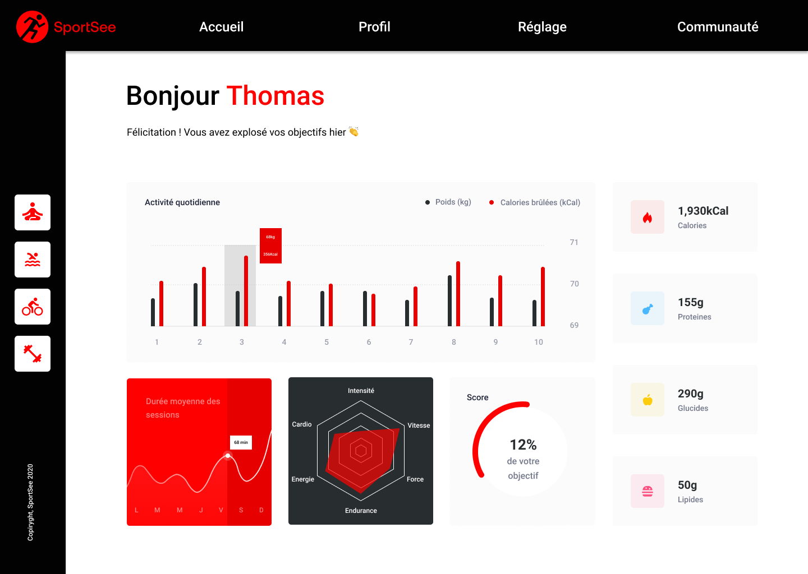

# Dependancies

- [React](https://reactjs.org/)
- [React router DOM](https://v5.reactrouter.com/web/guides/quick-start)
- [styled-components](https://styled-components.com/)
- [axios](https://axios-http.com/fr/docs/intro)
- [Recharts](https://recharts.org/en-US/)

# Installation

1. Get the [NodeJS backend](https://github.com/OpenClassrooms-Student-Center/P9-front-end-dashboard) (This project uses an API).
2. Only two users have been mocked. They have userId 12 and 18 respectively `http://localhost:3000/user/:id`.
3. Clone this repository `git clone https://github.com/GrimonprezAlexis/P12_SportSee`

4. Install NPM packages
   `npm i`

5. Run the project (port 3001 by default)
   `npm run start`

## About

SportSee, a startup dedicated to sports coaching.

### Job

Front-end Developer

### Objective

- Use [backend NodeJS](https://github.com/OpenClassrooms-Student-Center/P9-front-end-dashboard) to build in React profil page, rather than [maquette Figma](https://www.figma.com/file/BMomGVZqLZb811mDMShpLu/UI-design-Sportify-FR?node-id=0%3A1) (no need mobile / tablet version)
- Intégrer [le kanban avec les User Stories](https://www.notion.so/openclassrooms/Copy-of-Dev4U-projet-Learn-Home-6686aa4b5f44417881a4884c9af5669e) de la partie TODO

### Details

- [Mock API data](https://github.com/GrimonprezAlexis/P12_Sportsee/tree/main/public/json-mock-api/)
- API integration.
- Creation of a data modeling class to ensure that the API data is always formatted correctly before using it.

### Tips

- Use D3 or Recharts for the graphic part
- [Fetch](https://developer.mozilla.org/en-US/docs/Web/API/Fetch_API) or [Axios](https://github.com/axios/axios) or HTTP calls

### Technical constraints

- [Respect UI Design](https://www.figma.com/file/BMomGVZqLZb811mDMShpLu/UI-design-Sportify-FR?node-id=0%3A1)
- [Use NodeJS backend for HTTP calls](https://github.com/OpenClassrooms-Student-Center/P9-front-end-dashboard)
- Service dedicate outside of React components, for HTTP calls
- Integration of Proptypes for each React compound
- Readable on screens of at least 1024 by 780 pixels
- JSDoc in English (documented functions and methods)

> Heroku
> [#Projet 12 - SportSee](https://google.fr/)
